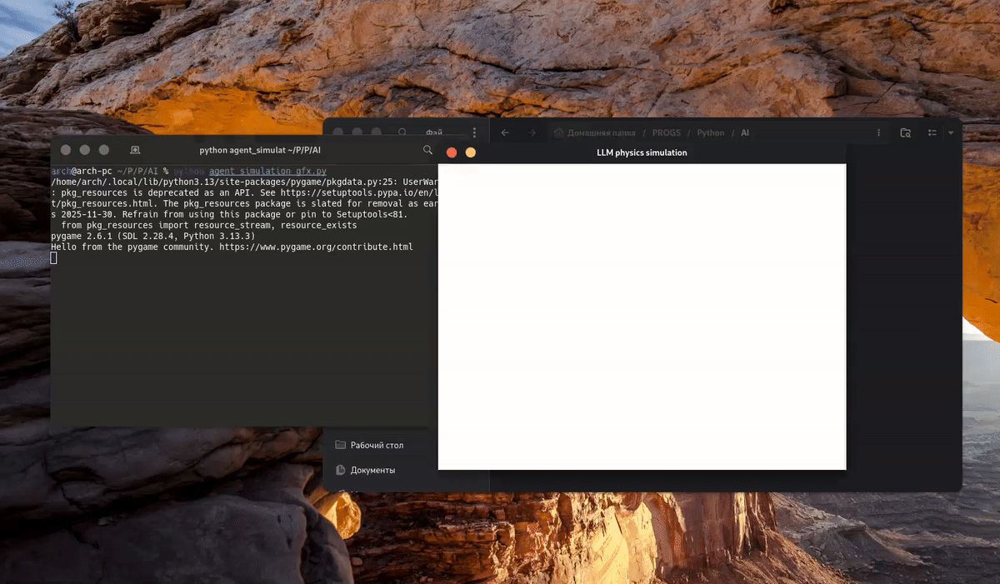

# LLM Physics Simulation (Prompt-Driven Engine)
A demonstration where a large language model (LLM **qwen3:4b** via **ollama**) acts as a physics engine — handling all object state and motion *purely* via natural language prompts.

## What is this?
- **No physics logic** is hardcoded in the program.
- The entire simulation is driven by **prompts** and a structured **JSON schema**.
- The LLM maintains the **state**, updates **positions** and **velocities**, and simulates physics over time — all through language understanding.

## Demo
  
*(100x speed, real-time simulation)*

## How it works
1. The initial prompt instructs the model to **create 3 balls with random velocities**.
2. The LLM replies with their **positions and velocities** in JSON format.
3. On each frame, the program sends a prompt:  
   `"Simulate next physics iteration with provided objects"`
4. The entire **simulation state is preserved via message history**, meaning **no local physics calculations** are performed.

## Why this matters
This project is a **proof-of-concept** showcasing how an LLM can serve as a **general-purpose computational kernel**, seamlessly blending **classic programming paradigms** with **AI-driven reasoning**.

It opens doors to new ways of programming — where **language itself becomes the executable code**.
